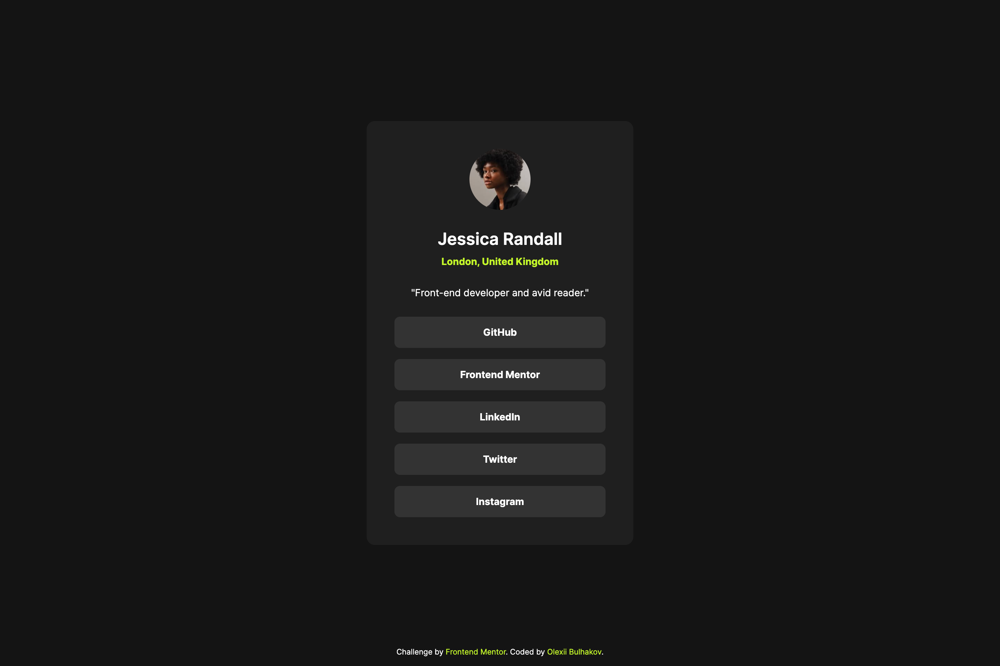

# Frontend Mentor - Social links profile solution

This is a solution to the [Social links profile challenge on Frontend Mentor](https://www.frontendmentor.io/challenges/social-links-profile-UG32l9m6dQ). Frontend Mentor challenges help you improve your coding skills by building realistic projects.

## Table of contents

- [Overview](#overview)
  - [The challenge](#the-challenge)
  - [Screenshot](#screenshot)
  - [Links](#links)
- [My process](#my-process)
  - [Built with](#built-with)
  - [What I learned](#what-i-learned)
  - [Continued development](#continued-development)
  - [Useful resources](#useful-resources)
- [Author](#author)

## Overview

### The challenge

Users should be able to:

- See hover and focus states for all interactive elements on the page

### Screenshot



### Links

- Solution URL: [GihHub repo](http://github.com/bulhakovolexii/social-links-profile/)
- Live Site URL: [GitHub pages](http://bulhakovolexii.github.io/social-links-profile/)

## My process

### Built with

- Semantic HTML5 markup
- [Normalize.css](https://necolas.github.io/normalize.css/)
- [Sass](http://sass-lang.com/)
- Flexbox

### What I learned

While working on this task, I didn’t encounter any significant difficulties. I decided to use the Sass preprocessor, just like in my previous project, to simplify styling with variables and mixins. However, this time, I moved all the additional code into a separate file, \_system.scss.

The only part where I had to refer to the documentation and seek help from Google was transitions. Now I’ll try to remember that the following code won’t work:

```scss
.links__item {
  a {
    transition: background-color color 0.2s ease-in; // For some reason, I thought I could list all the properties to apply the animation to.
  }
}
```

The correct approach is:

```scss
.links__item {
  a {
    transition: background-color 0.2s ease-in, color 0.2s ease-in;
  }
}
```

I haven’t worked much with animations before, so they haven’t stuck in my memory very well. Hopefully, I’ll have more opportunities to practice in future projects.

### Continued development

As recommended in the assignment, after submitting the project, I plan to personalize this page by replacing the photo and other details with my own.

### Useful resources

- [Sass installation](https://sass-lang.com/install/) - Here you can find instructions on installing the preprocessor and setting up a project for development.

## Author

- GitHub - [@bulhakovolexii](https://github.com/bulhakovolexii)
- Frontend Mentor - [@bulhakovolexii](https://www.frontendmentor.io/profile/bulhakovolexii)
- LinkedIn - [@bulhakovolexii](https://www.linkedin.com/in/bulhakovolexii/)
